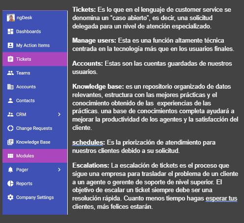
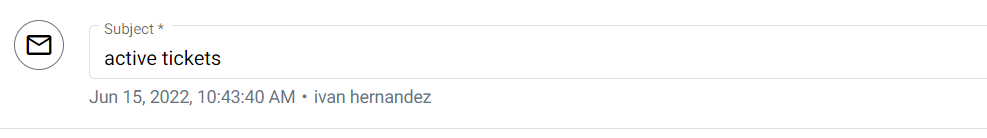

#                         NgDesk

# ¿Que es ngDesk?

ngDesk es una solución de atención al cliente basada en la nube. Está diseñada para ayudar a los equipos de asistencia al cliente con la gestión de tickets y la resolución de consultas. Entre las principales funciones, se incluyen gestión de formularios, colaboración, creación de chatbots, flujos de trabajo basados en reglas, administración de bases de conocimientos y comunicación multicanal

# ¿Quién usa ngDesk?

Desde la educación hasta la informática y la inmobiliaria, ngDesk ha ayudado a muchas empresas a aumentar la efectividad de su atención al cliente y la eficiencia de sus operaciones como una solución de servicio técnico integral.
 
# Inicio:

Para ingresar debemos empezar por regístranos con nuestro correo y contraseña previamente creados y damos clic en la opción login para así poder usar el programa.

El botón sign up nos permite crear una cuenta, esta nos dará un correo y una contraseña de nuestra elección.
Si clicamos en forgot password podremos acceder a un apartado en el caso de haber olvidado la contraseña en esta opción podremos recuperar nuestra contraseña e ingresar nuevamente en el programa NG DESK.

# Uso del programa:

La plataforma ngDesk incluye un panel centralizado que permite a los administradores crear diseños de listas para los tickets, además de agrupar los tickets según equipo, estado y otros campos.

Al estar en este menú podemos encontrar nuestros tickets que previamente hemos generado para nuestros clientes, en la parte izquierda podremos desplegar un menú de opciones en donde encontraremos lo siguiente.

 

 Al presionar en el sistema de tickets nos mostrará este menú:

En este menú de creación de tickets ponemos el correo para quien va dirigido el problema a solucionar del cliente, dependiendo la necesidad del cliente se envía a distintas áreas.

Pasando a esta opción esta es la parte en la que escribimos el problema para poder enviarlo al área indicada para responder con eficacia al problema, para después pasar a detallar en la siguiente parte …

Llegando a esta parte describimos detalladamente el problema para que al enviarlo al área encargada pueda dar solución al problema sin mayor demora logrando así eficacia, rapidez y calidad.

Los equipos pueden usar chatbots basados en reglas para capturar datos de clientes, guardar conversaciones pasadas para el análisis, optimizar la participación del cliente y acceder a métricas, como país de origen, navegador utilizado y páginas visitadas por los clientes.

Otra de las facilidades de usar NG-DESK es la posibilidad de llevar siempre con nosotros dicha aplicación ya que puede ser descargada en nuestro dispositivo móvil sin importar si somos usuarios de Android o 10S teniendo una interfaz simple haciéndola fácil de usar, al tener esta aplicación ya se en nuestro móvil O nuestra Tablet nos permite ser más eficaces a la hora de responder requerimientos de nuestros clientes.
                    
 
                       
                        https: //ngdesk.com